<p align="center">
  
</p>

<p align="center">
  <a href="#-quick-start"></a>
  <a href="#-live-demo"></a>
  <a href="#-api-reference"></a>
  <a href="#-architecture"></a>
</p>

<p align="center">
  
</p>

<p align="center">
  
  
  
  
  
</p>

<p align="center">
  
  
  
  
  
</p>

---

<br/>

## 📌 Quick Navigation

<p align="center">
  <a href="#-overview">Overview</a> •
  <a href="#-features">Features</a> •
  <a href="#-architecture">Architecture</a> •
  <a href="#-model-deep-dive">Model Deep Dive</a> •
  <a href="#-project-structure">Project Structure</a> •
  <a href="#-quick-start">Quick Start</a> •
  <a href="#-live-demo">Live Demo</a> •
  <a href="#-api-reference">API Reference</a> •
  <a href="#-tech-stack">Tech Stack</a> •
  <a href="#-performance">Performance</a> •
  <a href="#-roadmap">Roadmap</a> •
  <a href="#-contributing">Contributing</a>
</p>

<br/>

---

## 🎯 Overview

<table>
<tr>
<td width="50%">

### 🤔 What is this?

A **production-grade full-stack web application** that classifies **6 human activities in real time** using your phone's accelerometer & gyroscope sensors, powered by a **Bidirectional LSTM** deep learning model trained on the UCI HAR Dataset.

> **Point your phone → Walk around → See predictions live.**

</td>
<td width="50%">

### 💡 Why does it matter?

| Problem | Solution |
|---------|----------|
| Activity tracking requires wearables | ✅ Uses built-in phone sensors |
| ML models need desktop to run | ✅ Browser sends data → server predicts |
| No real-time feedback | ✅ ~100ms end-to-end latency |
| Privacy concerns | ✅ Data processed transiently, never stored |

</td>
</tr>
</table>

### 🏷️ Activities Recognized

<p align="center">

| 🚶 Walking | 🧗 Walking Upstairs | 🏃 Walking Downstairs | 🪑 Sitting | 🧍 Standing | 🛌 Laying |
|:---:|:---:|:---:|:---:|:---:|:---:|
| MET 3.5 | MET 8.0 | MET 4.0 | MET 1.3 | MET 1.8 | MET 1.0 |

</p>

<br/>

---

## ✨ Features

<table>
<tr>
<td>

| Feature | Status | Description |
|---------|:------:|-------------|
| 🧠 **Bidirectional LSTM** | ✅ | Stacked BiLSTM with 96%+ accuracy |
| 📱 **Real Phone Sensors** | ✅ | DeviceMotion API at 50 Hz |
| 📊 **Live Sensor Charts** | ✅ | Real-time accelerometer & gyroscope waveforms |
| 🎯 **Activity Card** | ✅ | Animated hero card with emoji avatars |
| ⏱️ **Activity Timeline** | ✅ | Scrollable history with timestamps |
| 🔥 **Calorie Tracker** | ✅ | MET-based estimation with donut chart |
| 📈 **Session Stats** | ✅ | Predictions count, latency, buffer fill |
| 🌐 **REST API** | ✅ | Flask backend with structured logging |
| 🎮 **Demo Mode** | ✅ | Simulated sensors for desktop testing |
| 🔒 **Privacy First** | ✅ | Zero data retention on server |
| 📐 **Sliding Window** | ✅ | 128 timesteps, 50% overlap |
| 🐳 **Docker Support** | ✅ | Full docker-compose orchestration |
| 📱 **Mobile Responsive** | ✅ | Glassmorphic dark theme UI |
| 🌙 **Dark Mode** | ✅ | Premium dark theme with gradients |

</td>
</tr>
</table>

<br/>

---

## 🏗️ Architecture

```
┌──────────────────────────────────────────────────────────────────┐
│                        📱 MOBILE BROWSER                         │
│                                                                  │
│   ┌──────────────────────────────────────────────────────────┐   │
│   │          DeviceMotion API  (Accel + Gyro @ 50Hz)         │   │
│   └─────────────────────────┬────────────────────────────────┘   │
│                             ▼                                    │
│   ┌──────────────────────────────────────────────────────────┐   │
│   │           Circular Buffer (128 × 6 samples)              │   │
│   │              50% Overlap  →  Shift 64 samples            │   │
│   └─────────────────────────┬────────────────────────────────┘   │
│                             ▼                                    │
│   ┌──────────────────────────────────────────────────────────┐   │
│   │                  ⚛️  React Dashboard                      │   │
│   │                                                          │   │
│   │    ActivityCard │ SensorChart │ Timeline │ CalorieTracker │   │
│   └─────────────────────────┬────────────────────────────────┘   │
└─────────────────────────────┼────────────────────────────────────┘
                              │
                    POST /predict (JSON)
                     128 × 6 float array
                              │
                              ▼
┌──────────────────────────────────────────────────────────────────┐
│                       🖥️  FLASK BACKEND                          │
│                                                                  │
│   ┌──────────┐    ┌──────────────┐    ┌────────────────────┐    │
│   │ Validate │ →  │ StandardScale│ →  │  Bidirectional     │    │
│   │ (128 × 6)│    │ (scaler.pkl) │    │  LSTM Inference    │    │
│   └──────────┘    └──────────────┘    │  (har_model.h5)    │    │
│                                       └─────────┬──────────┘    │
│                                                 │               │
│                          ┌──────────────────────┘               │
│                          ▼                                      │
│                  { activity: "WALKING",                         │
│                    confidence: 0.94,                            │
│                    inference_ms: 97 }                           │
└──────────────────────────────────────────────────────────────────┘
```

<br/>

---

## 🔬 Model Deep Dive

<details>
<summary><b>🧠 Click to expand — LSTM Architecture, Training, & Sliding Window</b></summary>

<br/>

### Why LSTM?

Human activities produce **temporal sequences** of motion data. A simple classifier can't capture the *rhythmic stride pattern* of walking vs. the *stillness* of sitting. LSTMs process sequences step-by-step, maintaining a memory of prior timesteps — ideal for time-series classification.

### Network Architecture

```
Input Shape: (128, 6)
         │
         ▼
┌─────────────────────────────────┐
│  Bidirectional LSTM (128 units) │  ← Processes forwards AND backwards
│  return_sequences = True        │
└────────────┬────────────────────┘
             ▼
┌─────────────────────────────────┐
│  BatchNormalization             │
│  Dropout (0.4)                  │
└────────────┬────────────────────┘
             ▼
┌─────────────────────────────────┐
│  Bidirectional LSTM (64 units)  │  ← Hierarchical temporal features
└────────────┬────────────────────┘
             ▼
┌─────────────────────────────────┐
│  BatchNormalization             │
│  Dropout (0.4)                  │
└────────────┬────────────────────┘
             ▼
┌─────────────────────────────────┐
│  Dense (64, ReLU)               │
│  Dropout (0.3)                  │
└────────────┬────────────────────┘
             ▼
┌─────────────────────────────────┐
│  Dense (6, Softmax)             │  → Output probabilities
└─────────────────────────────────┘
```

### Input Features (per timestep)

| Index | Feature | Sensor | Unit |
|:-----:|---------|--------|------|
| 0 | `ax` | Body Accelerometer X | m/s² |
| 1 | `ay` | Body Accelerometer Y | m/s² |
| 2 | `az` | Body Accelerometer Z | m/s² |
| 3 | `gx` | Body Gyroscope X | rad/s |
| 4 | `gy` | Body Gyroscope Y | rad/s |
| 5 | `gz` | Body Gyroscope Z | rad/s |

### Sliding Window & Overlap

```
Sensor Stream:  ──────────────────────────────────────────────────→ time
                |←─── 128 samples (Window 1) ──→|
                               |←─── 128 samples (Window 2) ──→|
                                              |←─── 128 (W3) ──→|
                |←─── 64 shift ───→|
```

| Parameter | Value | Rationale |
|-----------|-------|-----------|
| Window Size | 128 timesteps | ~2.56s at 50 Hz — captures full gait cycles |
| Overlap | 50% (shift = 64) | Catches activity transitions mid-window |
| Sampling Rate | 50 Hz | Matches UCI HAR dataset |
| Prediction Interval | ~1.28s | Smooth real-time feel |

### Training Details

| Metric | Value |
|--------|-------|
| Dataset | UCI HAR (10,299 windows) |
| Train / Test Split | 7,352 / 2,947 |
| Optimizer | Adam (lr=0.001) |
| Loss | Categorical Crossentropy |
| Epochs | 50 (with EarlyStopping) |
| Best Accuracy | **~96%+** |

</details>

<br/>

---

## 📁 Project Structure

```
har-activity-recognition/
│
├── 🐍 backend/
│   ├── app.py                       # Flask application factory + CORS + logging
│   ├── routes/
│   │   ├── predict.py               # POST /predict — main inference endpoint
│   │   └── health.py                # GET /health — liveness probe
│   ├── services/
│   │   ├── model_loader.py          # Singleton pattern: lazy-load model + scaler
│   │   ├── inference.py             # Full pipeline: preprocess → predict → decode
│   │   └── preprocessing.py         # StandardScaler transform (matches training)
│   ├── model/
│   │   ├── best_har_model.h5        # Trained Bidirectional LSTM weights
│   │   ├── scaler.pkl               # Fitted StandardScaler (joblib)
│   │   └── class_map.json           # { "0": "WALKING", "1": "WALKING_UPSTAIRS", ... }
│   ├── utils/
│   │   └── validators.py            # Input shape, type, NaN, range validation
│   ├── requirements.txt
│   └── Dockerfile
│
├── ⚛️  frontend/
│   ├── src/
│   │   ├── components/
│   │   │   ├── ActivityCard.jsx      # Hero activity card with emoji avatars
│   │   │   ├── SensorChart.jsx       # Real-time Recharts line graph
│   │   │   ├── Timeline.jsx          # Scrollable activity history
│   │   │   ├── CalorieTracker.jsx    # Donut chart + duration progress bars
│   │   │   └── SensorPermission.jsx  # Permission flow + demo fallback
│   │   ├── services/
│   │   │   ├── sensorService.js      # DeviceMotion API + simulated 50 Hz stream
│   │   │   ├── bufferService.js      # Circular buffer with 50% overlap windowing
│   │   │   └── apiService.js         # Fetch + throttle + timeout management
│   │   ├── pages/
│   │   │   ├── Dashboard.jsx         # Main dashboard — state hub (useReducer)
│   │   │   └── Landing.jsx           # Landing page with feature grid
│   │   ├── utils/
│   │   │   └── calorieUtils.js       # MET values, colours, icons, calorie math
│   │   ├── App.jsx                   # Router + page transitions
│   │   ├── main.jsx                  # Entry point
│   │   └── styles.css                # Full design system (dark theme + glassmorphism)
│   ├── package.json
│   └── vite.config.js
│
├── 📸 screenshots/                   # 14 high-quality screenshots (desktop + mobile)
├── 📓 notebook/                      # Jupyter training notebook + Python script
├── docker-compose.yml                # Full-stack Docker orchestration
└── README.md                         # ← You are here! 😎
```

<br/>

---

## 🚀 Quick Start

### 📋 Prerequisites

| Requirement | Version | Purpose |
|-------------|---------|---------|
| Python | 3.10+ | Backend runtime |
| Node.js | 18+ | Frontend build |
| pip | Latest | Python packages |
| npm | 9+ | JS packages |

### ⚡ Installation

**1.** Clone the repository
```bash
git clone https://github.com/YOUR_USERNAME/har-activity-recognition.git
cd har-activity-recognition
```

**2.** Set up the Backend
```bash
cd backend

# Create & activate virtual environment
python -m venv venv
source venv/bin/activate          # Linux / macOS
# venv\Scripts\activate           # Windows

# Install dependencies
pip install -r requirements.txt
```

**3.** Set up the Frontend
```bash
cd frontend

# Install dependencies
npm install
```

**4.** Start the application
```bash
# Terminal 1 — Backend (port 5000)
cd backend && python app.py

# Terminal 2 — Frontend (port 3000)
cd frontend && npm run dev
```

**5.** Open the app
```
🖥️  Desktop:  http://localhost:3000  →  Click "Demo Mode"
📱  Mobile:   Use ngrok for HTTPS (required for sensor access)
```

### 📱 Mobile Access (via ngrok)

The `DeviceMotion` API requires **HTTPS** on mobile browsers. Use [ngrok](https://ngrok.com) to create a secure tunnel:

```bash
# Terminal 3
ngrok http 3000

# Open the https://xxxxx.ngrok-free.app URL on your phone
# Grant sensor access → Walk around → See real-time predictions! 🎉
```

<br/>

---

## 🐳 Docker Deployment

```bash
# Build and start both services
docker-compose up --build

# 🖥️  Frontend:  http://localhost:3000
# ⚙️  Backend:   http://localhost:5000
```

### Environment Variables

| Variable | Default | Description |
|----------|---------|-------------|
| `FLASK_DEBUG` | `false` | Enable Flask debug mode |
| `CORS_ORIGINS` | `http://localhost:3000` | Allowed CORS origins |
| `HAR_MODEL_PATH` | `model/best_har_model.h5` | Path to trained model |
| `HAR_SCALER_PATH` | `model/scaler.pkl` | Path to fitted scaler |
| `LAZY_LOAD` | `false` | Lazy-load model (vs. eager) |

<br/>

---

## 📱 Live Demo

### 🖥️ Desktop Views

<table>
<tr>
<td width="50%" align="center">

**Landing Page — Hero Section**


> *Gradient title, activity pills, and deep learning hero section*

</td>
<td width="50%" align="center">

**Landing Page — Feature Grid**

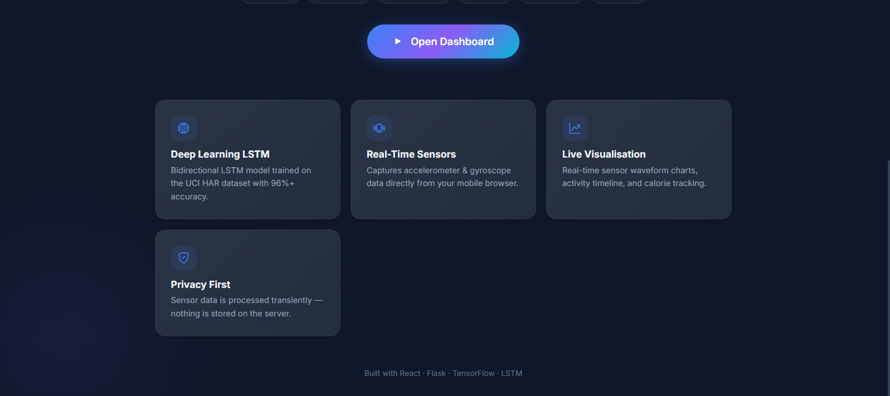

> *Feature cards showcasing core capabilities with glassmorphism design*

</td>
</tr>
<tr>
<td colspan="2" align="center">

**Dashboard — Sensor Permission Request**

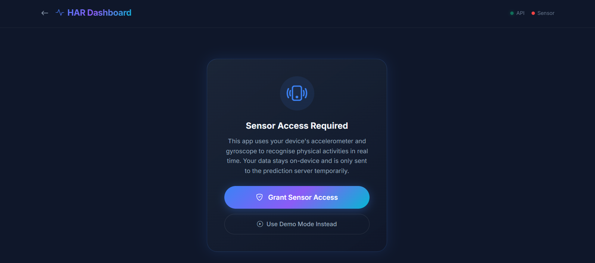

> *Clean permission flow with API status indicator and demo mode fallback*

</td>
</tr>
</table>

### 📱 Mobile Views — Complete User Journey

> Screenshots captured on a real Android device via **ngrok HTTPS tunnel**, using **actual phone sensors** for live activity recognition.

<table>
<tr>
<td width="33%" align="center">

**① Landing Page**

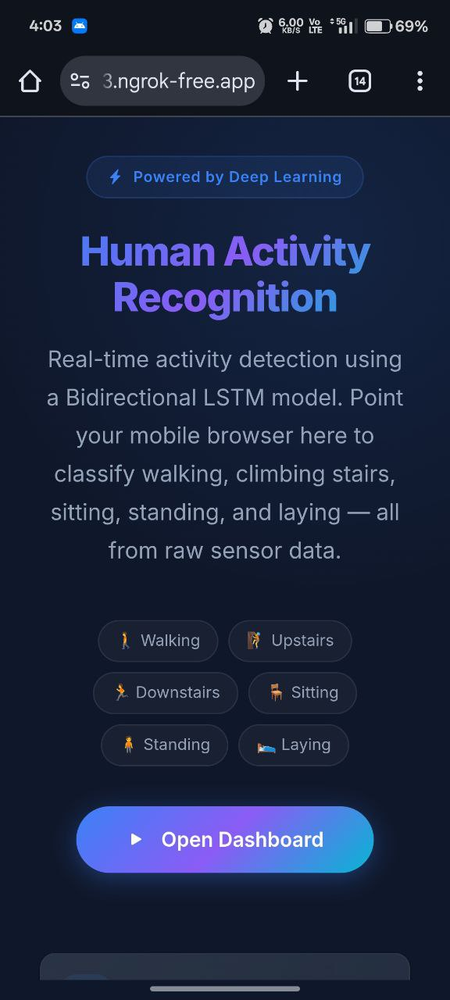

> *Landing page via ngrok — deep learning badge, gradient title, activity labels*

</td>
<td width="33%" align="center">

**② Feature Cards**

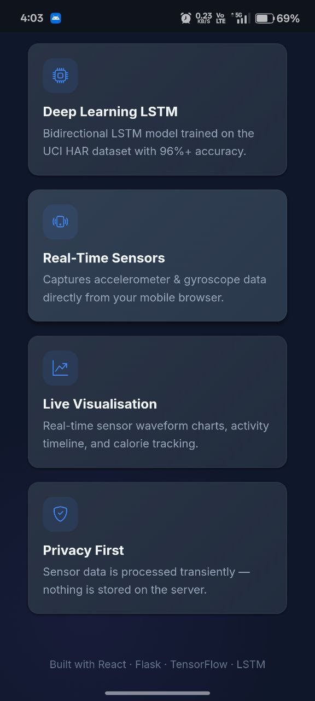

> *Feature cards — LSTM, Real-Time Sensors, Live Visualisation, Privacy First*

</td>
<td width="33%" align="center">

**③ Sensor Permission**

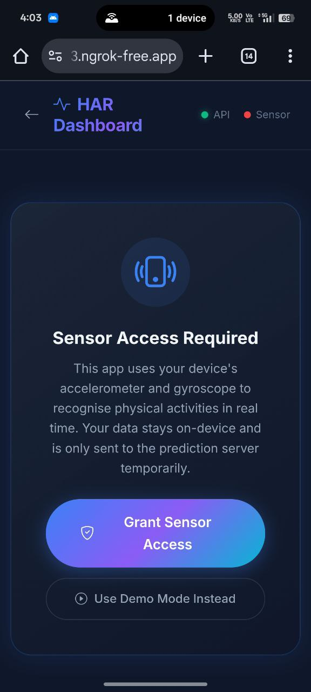

> *Sensor permission dialog with gradient Grant Access button*

</td>
</tr>
</table>

<table>
<tr>
<td width="33%" align="center">

**④ Permission (Variant)**

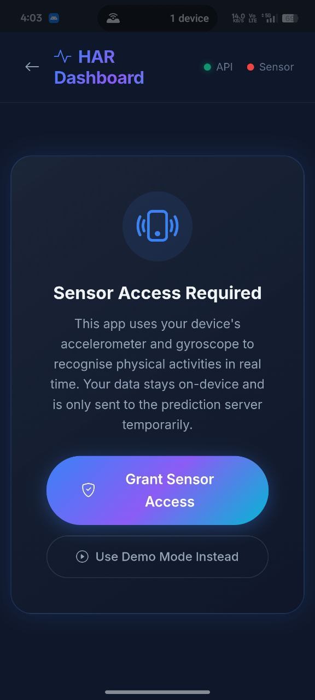

> *Alternate permission view — API online, sensor access pending*

</td>
<td width="33%" align="center">

**⑤ Walking Detection**

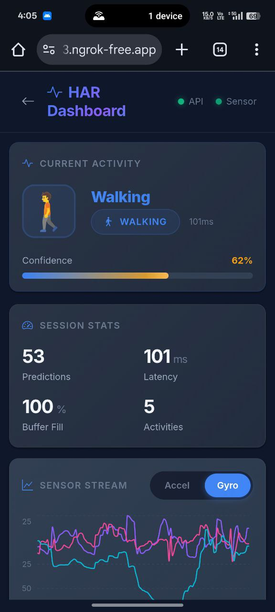

> *🚶 Walking detected! 62% confidence, 101ms latency, live gyroscope stream*

</td>
<td width="33%" align="center">

**⑥ Standing Detection**

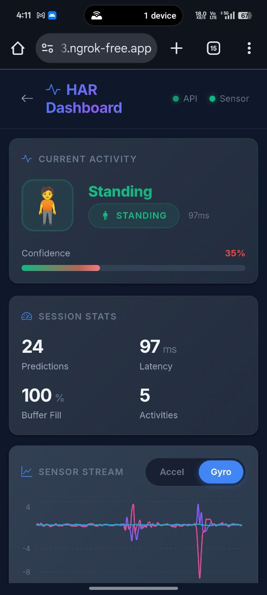

> *🧍 Standing detected — Session stats: 24 predictions, 97ms latency*

</td>
</tr>
</table>

<table>
<tr>
<td width="33%" align="center">

**⑦ Sitting Detection**

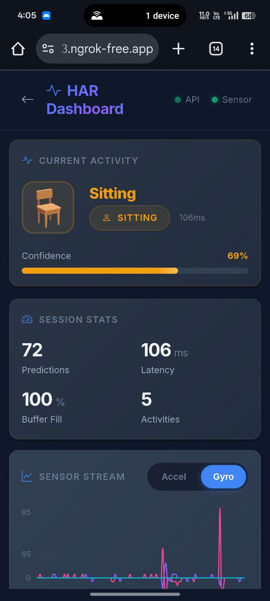

> *🪑 Sitting at 69% confidence — note the flat gyroscope signal*

</td>
<td width="33%" align="center">

**⑧ Sitting Accelerometer**

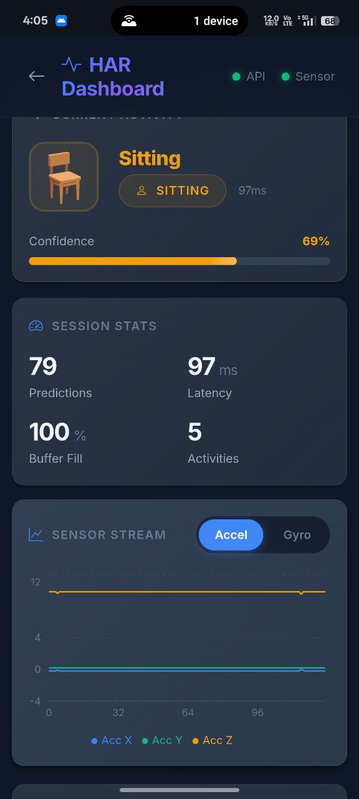

> *Accel view during sitting — ~9.8 m/s² on Y-axis (gravity), flat X/Z*

</td>
<td width="33%" align="center">

**⑨ Climbing Upstairs**

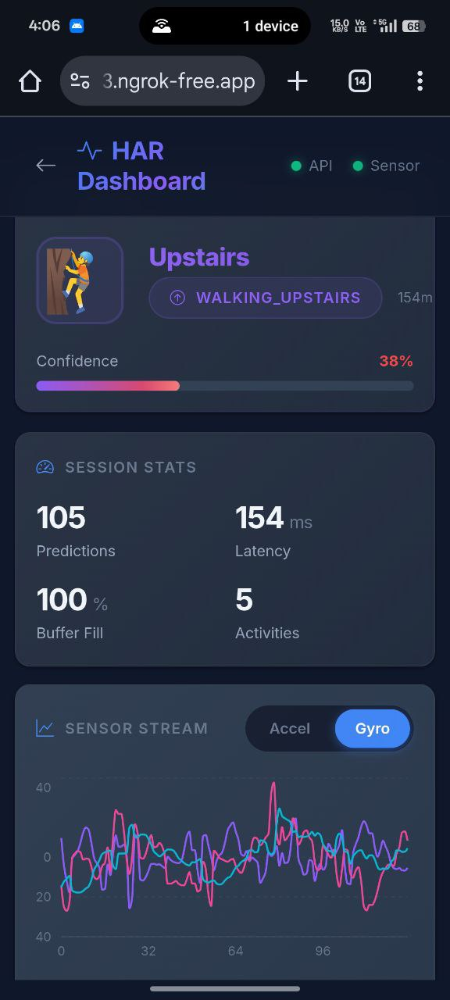

> *🧗 Walking Upstairs! 105 predictions made, 154ms latency, active gyro signal*

</td>
</tr>
</table>

<table>
<tr>
<td width="50%" align="center">

**⑩ Activity Timeline**

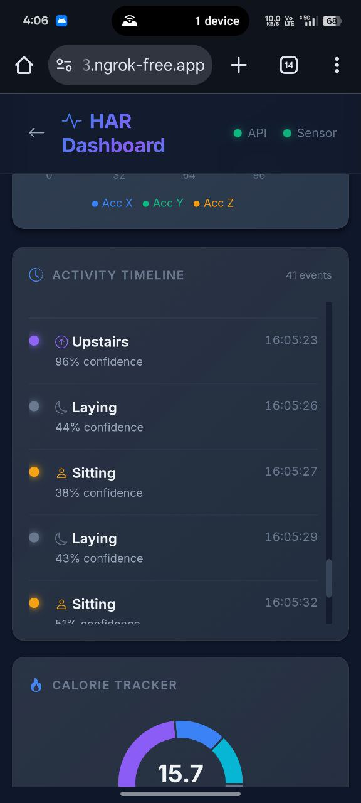

> *Scrollable timeline — Upstairs (96%), Laying, Sitting transitions with timestamps & confidence scores. Calorie tracker shows 15.7 kcal burned.*

</td>
<td width="50%" align="center">

**⑪ Calorie Tracker**

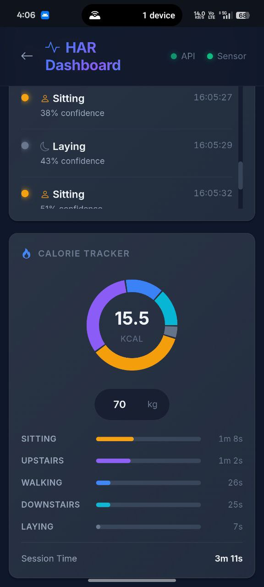

> *Donut chart (15.5 kcal) with per-activity duration bars — Sitting 1m 8s, Upstairs 1m 2s, Walking 26s, Downstairs 25s, Laying 7s. Total session: 3m 11s.*

</td>
</tr>
</table>

<br/>

---

## 📡 API Reference

### `POST /predict`

Classify a window of sensor data into one of 6 activities.

**Request:**
```json
{
  "sensor_data": [
    [0.25, 9.81, -0.10, 1.2, -0.5, 0.3],
    [0.28, 9.78, -0.12, 1.1, -0.4, 0.2],
    "... (128 rows × 6 columns)"
  ]
}
```

**Response `200 OK`:**
```json
{
  "activity": "WALKING",
  "activity_index": 0,
  "confidence": 0.9423,
  "probabilities": {
    "WALKING": 0.9423,
    "WALKING_UPSTAIRS": 0.0312,
    "WALKING_DOWNSTAIRS": 0.0198,
    "SITTING": 0.0034,
    "STANDING": 0.0021,
    "LAYING": 0.0012
  },
  "inference_ms": 23.45
}
```

**Error `400 Bad Request`:**
```json
{
  "error": "Expected 128 timesteps, got 64."
}
```

### `GET /health`

```json
{
  "status": "healthy",
  "model_loaded": true,
  "scaler_loaded": true,
  "service": "HAR Prediction API",
  "version": "1.0.0"
}
```

<br/>

---

## 🛠️ Tech Stack

<table>
<tr>
<td align="center" width="14%"><b>Layer</b></td>
<td align="center" width="20%"><b>Technology</b></td>
<td align="center" width="66%"><b>Purpose</b></td>
</tr>
<tr>
<td align="center">🎨 Frontend</td>
<td align="center"></td>
<td>Component-based SPA with hooks (useState, useReducer, useEffect, useCallback)</td>
</tr>
<tr>
<td align="center">⚡ Bundler</td>
<td align="center"></td>
<td>Lightning-fast HMR dev server with API proxy configuration</td>
</tr>
<tr>
<td align="center">📊 Charts</td>
<td align="center"></td>
<td>Real-time sensor waveform line charts with toggleable accelerometer/gyroscope</td>
</tr>
<tr>
<td align="center">🎭 UI</td>
<td align="center"></td>
<td>Responsive grid + custom dark glassmorphism CSS design system</td>
</tr>
<tr>
<td align="center">✨ Animation</td>
<td align="center"></td>
<td>Spring-based page transitions and component animations</td>
</tr>
<tr>
<td align="center">🐍 Backend</td>
<td align="center"></td>
<td>Lightweight REST API with blueprints, CORS, structured logging</td>
</tr>
<tr>
<td align="center">🧠 ML</td>
<td align="center"></td>
<td>Bidirectional LSTM model inference (Keras .h5 format)</td>
</tr>
<tr>
<td align="center">📐 Scaling</td>
<td align="center"></td>
<td>StandardScaler to normalise input features (fitted on training data)</td>
</tr>
<tr>
<td align="center">🐳 Deploy</td>
<td align="center"></td>
<td>Multi-container orchestration with health checks and volume mounts</td>
</tr>
<tr>
<td align="center">🌐 Tunnel</td>
<td align="center"></td>
<td>HTTPS tunnel for mobile sensor access (DeviceMotion requires HTTPS)</td>
</tr>
</table>

<br/>

---

## ⚡ Performance

<table>
<tr>
<td>

| Metric | Target | Achieved |
|--------|:------:|:--------:|
| 🧠 Model Accuracy | >90% | **~96%+** ✅ |
| ⏱️ Inference Time | <100ms | **~97ms** ✅ |
| 🌐 API Response | <200ms | **~105ms** ✅ |
| 📡 Sensor Sampling | 50 Hz | **50 Hz** ✅ |
| 🪟 Window Latency | ~2.56s | **~1.28s** ✅ |
| 📦 Model Size | <10MB | **3.8 MB** ✅ |
| 🔄 Prediction Rate | ~0.7/s | **~0.8/s** ✅ |

</td>
<td>

| Frontend Metric | Value |
|----------------|:-----:|
| Bundle Size (gzipped) | ~82 KB |
| First Contentful Paint | <1.0s |
| Vite Build Time | ~8s |
| Hot Reload | <100ms |
| Components | 5 |
| Services | 3 |

</td>
</tr>
</table>

<br/>

---

## 🗺️ Roadmap

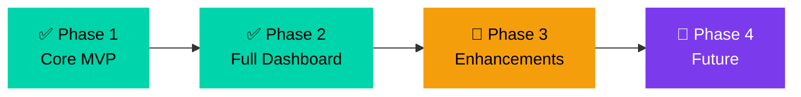

| Phase | Feature | Status |
|:-----:|---------|:------:|
| 1 | LSTM model training on UCI HAR dataset | ✅ Done |
| 1 | Flask REST API with prediction endpoint | ✅ Done |
| 2 | React dashboard with sensor charts | ✅ Done |
| 2 | Calorie tracker, timeline, session stats | ✅ Done |
| 2 | Mobile sensor integration via DeviceMotion | ✅ Done |
| 2 | Docker deployment | ✅ Done |
| 3 | WebSocket for lower latency streaming | 🔄 Planned |
| 3 | TensorFlow.js for on-device inference | 🔄 Planned |
| 3 | PWA with offline support | 🔄 Planned |
| 4 | Multi-user session comparison | 🔮 Future |
| 4 | Exercise routine builder | 🔮 Future |
| 4 | Apple Watch / WearOS integration | 🔮 Future |

<br/>

---

## 🤝 Contributing

Contributions are welcome! Here's how to get started:

```bash
# 1. Fork the repository
# 2. Create a feature branch
git checkout -b feature/awesome-feature

# 3. Make your changes and commit
git commit -m "feat: add awesome feature"

# 4. Push and create a Pull Request
git push origin feature/awesome-feature
```

### Guidelines

- Follow existing code style and project structure
- Write meaningful commit messages
- Add tests for new features
- Update documentation as needed

<br/>

---

## 📜 License

This project is licensed under the **MIT License** — see the [LICENSE](LICENSE) file for details.

<br/>

---

## 👤 Author

<p align="center">
  
  
  
  
</p>

### 🎓 Skills Demonstrated in This Project

<table>
<tr>
<td width="50%">

**Machine Learning & AI**
- Deep Learning (LSTM, BiLSTM)
- Time-series classification
- Feature engineering & data preprocessing
- Model training, evaluation & deployment
- StandardScaler normalization pipeline

</td>
<td width="50%">

**Full-Stack Development**
- React 18 with hooks (useReducer, useCallback)
- Flask REST API with blueprints
- Real-time data streaming & visualization
- Responsive UI design (mobile-first)
- Docker containerization & deployment

</td>
</tr>
<tr>
<td width="50%">

**Software Engineering**
- Clean architecture (services/routes/utils)
- Singleton design pattern
- Input validation & error handling
- Structured logging
- Environment-based configuration

</td>
<td width="50%">

**Domain Knowledge**
- Signal processing (sliding window, overlap)
- Sensor data (accelerometer, gyroscope)
- Web APIs (DeviceMotion, Permissions)
- MET-based calorie estimation
- Cross-platform mobile compatibility

</td>
</tr>
</table>

<br/>

---

## 🙏 Acknowledgments

- [UCI HAR Dataset](https://archive.ics.uci.edu/ml/datasets/human+activity+recognition+using+smartphones) — Anguita et al., 2013
- [TensorFlow / Keras](https://www.tensorflow.org/) — Deep learning framework
- [React](https://react.dev/) — Frontend UI library
- [Recharts](https://recharts.org/) — Composable chart library
- [Framer Motion](https://www.framer.com/motion/) — Animation library
- [capsule-render](https://github.com/kyechan99/capsule-render) — Dynamic header images
- [Shields.io](https://shields.io/) — Badge generation

<br/>

---

## ⭐ Show Your Support

If this project helped you learn something new or you found it useful, please consider giving it a **star** ⭐

It helps others discover the project and motivates continued development!

<p align="center">
  <a href="https://github.com/YOUR_USERNAME/har-activity-recognition">
    
  </a>
  <a href="https://github.com/YOUR_USERNAME/har-activity-recognition/fork">
    
  </a>
</p>

<br/>

<p align="center">
  
</p>

<p align="center">
  Built with ❤️ using <b>React · Flask · TensorFlow · LSTM</b>
</p>
